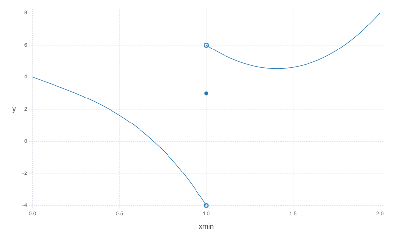

# Delay Hybrid Systems

Lorenz Sahlmann

Ecole Polytechnique
Carnegie-Mellon-University

## Delay Differential Equations

### Piecewise Continuous Functions
The following definition is motivated to capture the character of a variable evolution arising from hybrid
consider it to be piecewise continuous

##### Definition (Piecewise Continuous)
TODO: function def on [a,b], cont on [a,b) and jump in b, but next part has same value in b  and the continuity condition holds $g(x_{i+1}) = \lim_{x\searrow x_{i+1}, x\in[x_{i+1},x_{i+2})}g(x)$

Let $D=[a,b]\subset\R$ be a closed interval. The mapping $g:D\rightarrow\R^n$ is called **piecewise continuous** if and only if there is a finite subdivision $\{x_i:i=0,\ldots,n\}$ of $D$ (\ie $a=x_0<x_1<\ldots<x_n=b$) such that $g$ is continuous on $[x_i,x_{i+1})$ for all $i=0,\ldots,n-1$ and the one sided limits

$$ \lim_{x\nearrow x_{i+1}, x\in[x_i,x_{i+1})}g(x) $$

exist. So $g(b)$ can be an isolated point and this right interval limit $b$ is the only spot where such is allowed.

We denote by $C^0_\text{pw}(D,\R^n)$ the set of **piecewise continuous functions** on the compact interval $D$.

### Definition DDE
TODO: adopted to our needs

Let $f:\R^n\times\R^n\rightarrow\R^n$ and $\tau > 0$. A functional equation of the form

\[ x'(t) = f\left(x(t),x(t-\tau)\right) \]

is called **Delay Differential Equation (DDE)** with _constant, discrete delay_.
It is _autonomous_, since its right hand side $f$ is time independent.

If the right hand side only depends on $x(t-\tau)$ and not on $x(t)$, we call the DDE _pure_.

TODO: initial condition
Obviously, such an equation should be equipped with a initial condition, which specifies the values of $x$ on $[-\tau, 0]$ on which the right hand side depends.

TODO: multiple constant discrete delays would also be possible.

### Definition of Solution
TODO: solution if initial condition piecewise continuous (-> not cont in t=0)

A piecewise continuous function $x\in C^0_\text{pw}([-\tau,T],\R^n)$ is called **local solution** of the DDE (??), if and only if there exists a $T>0$ such that $x|_{(0,T)}\in C^1((0,T),\R^n)$ with

\[ x'(t) = f\left(x(t),x(t-\tau)\right) \]

for $t\in (0,T)$ and right-hand derivative $=f(x(0),x(-\tau))$ in $t=0$.
differentiable in rand points? what is diff there? dde gives value. one sided diff? in t=0 right-hand deriv
and obeys the initial condition:

$$ x(t) = x_0(t) \quad\text{for } t\in [-\tau,0]$$

on $[-\tau,0]$.

If the function $x$ is solution for all $T\in\R_{>0}$, it is called **global**.

TODO: solution (for autonomous) is curve/trajectory in statespace
state at t provides all information needed to determine solution for time >= t. Hence needs to contain initial function
write state $\xbartau\in\statespace$
defined as $\xbartaut(s):=x(t+s)$ for $s\in [-\tau,0]$
is a dynamical systems point of view
cav write DDE (??) as

$$ \label{eq:test}\begin{cases}
    x'=g(\xbartaut):=f(\xbartaut(0),\xbartaut(-\tau)) &\text{for } t\geq 0\\
    x(t)=x_0(t) & \text{for } t\in[-\tau,0]
   \end{cases} $$

##### Lemma
TODO: solving dde equiv to solving integral equation??? (-> Lemma) and compare with ODE lecture notes

Finding a solution of the DDE (??) is equivalent to computing the integral

$$
    x(t) = x_0(0) + \int_0^t g(\bar{x}_{\tau,s})ds
$$

##### Proof
integrate from discontinuity of $\xbartaut$ to discontinuity and proof stetige fortsetzbarkeit at these points

### Method of Steps
for $t\in [0,\tau]$, $x$ must satisfy the following ordinary initial value problem obtained by plugging the initial function into equation (??).
For suitable $f$ and $x_0$, the existence (and uniqueness) of a solution on $[0,\tau]$ is guaranteed by ODE theory (... or Picard-Lindelöf theorems).

This procedure can then be applied repeatedly to extend the obtained solution by steps of length $\tau$.

### Existence and Uniqueness of Solutions

$f$ Lipschitz
with piecewise continuous initial function
have existence and uniqueness ????
smoothing

##### Theorem
Consider the Delay Differential Equation

$$
\begin{cases}
    x'=f(\xbartaut) & \text{for } t\geq 0\\
    x(t)=x_0(t)     & \text{for } t\in [-\tau,0]
\end{cases}
$$

with $f:\statespace\rightarrow\R^2$ satisfying the (global) Lipschitz condition

$$ \exists L>0\,\forall x,y\in C^0([-\tau,0],\R^n) : \abs{f(x)-f(y)} \leq L\norm{x-y} $$

where $\abs{\cdot}$ denotes the Euclidian norm on $\R^?$ (TODO) and $\norm{\cdot}$ the supremum norm of the Banach space of continuous functions on $[-\tau,0]$.

and initial condition

Then there **exists** a **unique global solution** of the DDE.

##### Proof
use Theorem 3.7 from [] or ...
need open subset of $\statespace$
need topology

just proof existence/uniqueness on each peace of continuity
proof continuity at knots with Lemma of integral equ

### Example
The basic ODE IVP

$$ \begin{cases}
  x'(t) = -x(t)\\
  x(0) = x_0
\end{cases} $$

has the solution $x(t)=x_0 e^{-t}$.
However the similiar DDE

$$ \begin{cases}
  x'(t) = -x(t-\tau) & t\geq 0\\
  x(t) = x_0(t) & -\tau\leq t\leq 0
\end{cases} $$

has a much richer dynamics, but solution (as series)
for $x_0\equiv 1$, can compute first solutions by method of steps.
...

### Definition

## Hybrid Programs with DDEs
Extent classic hybrid programs (HP) with syntax, semantics and axiomatization and proof rules for DDEs. Is a super set, \dL is a fragment

### Example
leading and following car

### Syntax
#### Terms
We extent the definitions of terms with a symbol for a **delayed variable**

$$ \theta,\eta ::= x|\xtau|c|\theta+\eta|\theta\cdot\eta $$

### Semantics
HP $\alpha$
binary reachability relation $\rho(\alpha)\subseteq\states\times\states$
transition semantics
define inductively

remain unchanged

### Terms
New **state space** $\statespace$, the set of piecewise continuous functions.

Denote by $\states$ the set of states.
A state $\omega\in\states$ is a mapping $\omega : \mathcal{V}\cup\mathcal{V'}\rightarrow\statespace$
that assigns a _history_ (function) $\xbartau$ to each variable symbol and diff var symbol.

$$ [\xtau]_\nu=\nu(x)(-\tau)=:\xbartau(-\tau) $$

and update the semantics of

$$ [x]_\nu=\nu(x)(0)=:\xbartau(0) $$

So when we write $\xtau$ we mean $x(t-\tau)$ and with $x$ we mean $x(t)$.

### Continuous Programs
Using that, we can write down a delay differential equation or an ordinary differential equation in the form $x'=\theta$, where $\theta=f(x,\xtau)$ with a polynomial $f$.

### Discrete Programs
discrete assignment
does not rewrite history
hence piecewise continuous functions
super dense time: multiple assignments

## Delay Differential Dynamic Logic

\dL terms

### Axiomatization

#### Method of Steps

### Proof Rules

#### Rule of Steps

### Example
We want to proof the safety condition $\phi\equiv(-1\leq x\wedge x\leq 1)$.
Use the algebraic differential invariant
$F\equiv(-1\leq x^3\wedge x^3\leq1)$.
